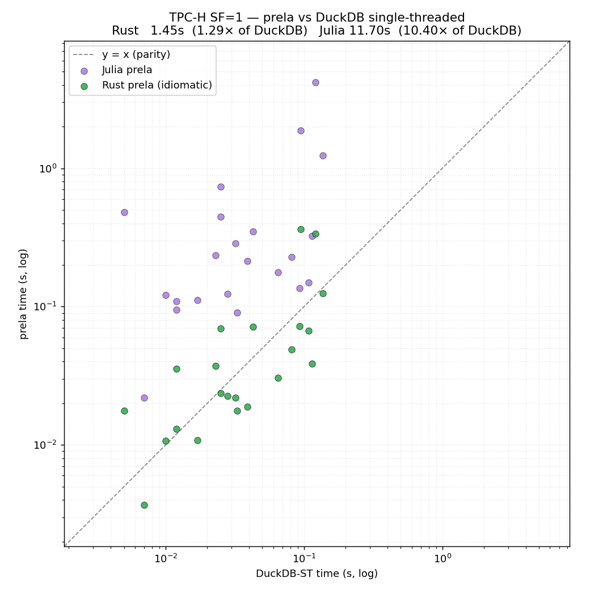
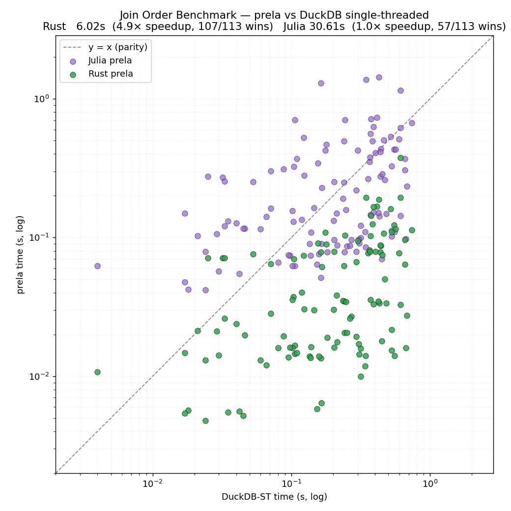

# Prela: A Compositional & Controllable Query Language

> "The calculus of relations has an intrinsic charm and beauty which makes it a source of intellectual
> delight to all who become acquainted with it." —Alfred Tarski

[**Prela**](https://github.com/remysucre/prela) is an embedded query language focusing on compositionality and control. 
Its queries are concise, clear, and fast.
It is implemented as a library of *query combinators* (think [parser combinators](https://en.wikipedia.org/wiki/Parser_combinator)),
 allowing the user to freely intermix queries with code in the host programming language. 
The implementation follows [continuation-passing style](https://remy.wang/blog/cps.html),
 resulting in a core engine under 1k lines of code that compiles to efficient columnar execution.
Unlike almost all SQL databases, Prela does not come with its query optimizer,
 and queries are executed exactly as they are written.
This gives the user complete control over all aspects of query planning,
 including join ordering, operator pushdown, materialization, and selection of physical data structures.
Nevertheless, the most idiomatic way to write a query already performs well in our experiments. 

> [!NOTE]
> Prela is a research prototype in early development. 
> Expect constant and sweeping changes to both language design and implementation.

## Example

Consider Join Order Benchmark [22a](https://github.com/gregrahn/join-order-benchmark/blob/master/22a.sql):

```rust
movie.with(info.select(Info::ty.eq("countries")
                  .and(Info::info.is_in(["Germany", "German", "USA", "American"])))
      .and(keyword.is_in(["murder", "murder-in-title", "blood", "violence"]))
      .and(production_year.gt(2008))
      .and(kind.is_in(["movie", "episode"])))
   .select(title
      .and(data.with(Data::text.lt("7.0")
                .and(Data::ty.eq("rating"))).text())
      .and(company.with(Company::note.nrx(r"\(USA\)")
                   .and(Company::note.rx(r"\(200.*\)"))
                   .and(country.ne("[us]"))
                   .and(Company::ty.eq("production companies"))).name()))
```

Intuitively, the query looks for `movies` satisfying several conditions:

- It's German or American
- It's a thriller
- It's produced after 2008
- It's a movie or a TV series episode (which we'll also just call a "movie")

Then, for each such movie, output the following attributes:

- Its title
- Its rating, if lower than 7
- Its production company, if satisfying further conditions

In SQL's way of thinking, `movie` would be in the `FROM` clause (along with other tables involved),
 `with` corresponds to the `WHERE` clause,[^1]
 and `select` corresponds to the `SELECT` clause.
But unlike SQL, Prela can freely interleave predicates and outputs,
 resulting in more natural queries as shown above.
You can also think of `data.with(...).text()` and `company.with(...).name()` parts as *subqueries*
 which require special syntax in SQL, but are just subexpressions in Prela. 
And instead of explicit conditions,
 joins in Prela are reflected by the *structure* of the query in a navigational style.

[^1]: Sadly `where` is reserved in Rust. 

## Data Model and Simple Queries

To understand what's going on under the hood, we should first clarify
 the data model used by Prela.
The theoretical foundation of Prela is a formalism of relations
 100 years older than the familiar *relational* algebra,
 called (confusingly) [*relation* algebra](https://en.wikipedia.org/wiki/Relation_algebra).
To avoid confusion, I will call it
 [Tarski's Algebra of Relations](https://www.cl.cam.ac.uk/teaching/1415/Databases/Tarski_1941.pdf) (TAR)
 after the logician responsible for its modern formalization. 
In TAR (and therefore Prela), everything is a *binary* relation,
 and a query is built up with operators that take in and produce binary relations,
 which I call *relation combinators*.
One way to think about this is a very extreme form
 of normalization: every table with k columns
 is "shredded" into k binary tables, one per column.

Let us consider a simplified version of the query above:

```rust
movie.with(production_year.gt(2008)).select(title)
```

Here, `title` and `production_year` are both attributes of
 the same table in the original schema,
 but in Prela, each of them becomes a binary relation,
 mapping every movie (ID) to its title and production year, respectively.
`movie` is also a binary relation, albeit a little special:
 it corresponds to the primary-key ID column of the original table,
 and is the *identity* relation over the IDs;
 in other words, `movie` contains `(i, i)` for every ID `i` in the table.
Overall, each "column table" can be thought of as a map from the primary
 key to its corresponding value.

Comparisons like `.gt()` and `.is_in()` are regular Rust methods on relations.
For example, `production_year.gt(2008)` returns a binary relation that's
 a subset of `production_year`, such that the second column (the "value" column)
 contains only values greater than 2008.

Next, `.with()` is the *restriction* combinator:
 `r.with(s)` restricts the last column of the `r` with the first column of the `s`;
 i.e., it is exactly a left-semijoin.
In this example, `movie.with(production_year.gt(2008))`
 semijoins `movie` with the filterd-out `production_year` relation,
 and since `movie` is the identity relation,
 we're left with the IDs for movies made after 2008.

The `.select()` combinator is *relational composition*.
It is the workhorse of both Prela and TAR.
The key to understanding relational composition is to view relations as 
 a generalization of functions:
 a binary relation of type `(X, Y)`
 generalizes a function of type `X -> Y`
 by allowing multiple different "output" (`Y`) values
 per "input" (`X`).
For this reason, we will abuse `X -> Y` to denote the type of a binary relation.

From this perspective, it is then natural to see `select`
 as a generalization of the function composition ($f \circ g$):
 `r.select(s)` first "applies" `r` to each `x` to get a bunch of `y`,
 then for each `y`, apply `s` to get a bunch of `z`.

In math: $R \circ S = \lbrace (x, z) \mid \exists y . (x, y) \in R \land (y, z) \in S \rbrace$.
In standard relational algebra: $R \circ S = \pi_{x, z}(R \Join_{R.y = S.y} S)$ 
 where R's schema is over x and y, and S's schema is over y and z.

Going back to our example, `.select()` takes two inputs:

- `movie.with(production_year.gt(2008))`, which has all movies after 2008
 and is of type `Movie -> Movie`
- `title` which has type `Movie -> String`

Their composition then produces an output of type `Movie -> String`,
 namely, a mapping from each qualifying movie to its title.

Another (perhaps more natural) way to think about all these is to pretend
 every movie is a JSON object called `movie`,
 and its attributes like `title` and `production_year` are JSON attributes,
 then `.select()` will feel like field access, and `.with()` lets you specify filters.

There is one more construct in our original example,
 namely the *product* combinator `.and()`.
It takes two relations of types `X -> Y` and `X -> Z`,
 and joins them on `X` to produce an output of type `X -> (Y, Z)`.
When used as a conjunction in the `with` clause,
 product allows us to combine different predicates:

```rust
      .and(production_year.gt(2008))
      .and(kind.is_in(["movie", "episode"])))
```

When used in `select`, it combines different columns in the output:
 in the full example, we output title, data (with additional filters),
 and company name - the last because
 `company.with(...).name()` computes a relation of type `Movie -> String`
 mapping each movie to its company's name.

## CTEs, UDFs, and Aggregation

Since Prela is directly embedded in the host language,
 we can borrow many constructs from the host to get
 many features that are considered advanced in other query languages,
 *for free*.
Consider TPCH [q21](https://github.com/dragansah/tpch-dbgen/blob/master/tpch-queries/21.sql):

```rust
let late = lineitem.with(commitdate.and(receiptdate).filt(|(c, r)| c < r));

// EXISTS another supplier on the order (across all lineitems)
let multi_supp = Lineitem::supplier.group_by(order).count_distinct().gt(1);
// NOT EXISTS another LATE supplier (only L1 is late)
let only_late = (&late).select(Lineitem::supplier)
    .group_by((&late).select(order))
    .count_distinct().eq(1);

let saudi = supplier.and(Supplier::nation.eq("SAUDI ARABIA"));
let f_ords = orders.and(Order::status.eq("F"));
let qualifying = (&late)
    .with(Lineitem::supplier.select(saudi)
     .and(order.select(f_ords.and(multi_supp).and(only_late))));

let counts = qualifying.group_by(Lineitem::supplier).fold(0_i64, |a, _| a + 1);
```

The `let` bindings assign sub-queries to variables — which would require CTEs in SQL,
 but is simply a variable binding in Prela/Rust.
Where SQL needs a UDF, Prela passes an ordinary closure,
 e.g., the predicate in `.filt(|(c, r)| c < r)`
 and the accumulator `|a, _| a + 1` passed to `fold`. 

The next new Prela construct excercised by this query is group-by aggregation.
Let's focus on the expression `Lineitem::supplier.group_by(order).count_distinct().gt(1)`.
You can probably guess it corresponds to the SQL query:

```SQL
  SELECT order, supplier
    FROM lineitem
GROUP BY order
  HAVING COUNT DISTINCT(supplier) > 1
```

In SQL, `GROUP BY`, `HAVING`, and `COUNT` must all come together, 
 and missing a clause triggers a parse error.
But in our Prela query, `.group_by()`, `count_distinct()`, and `.gt()`
 are just regular Rust functions,
 so how do we make sure all of them are called together?
We don't.

To understand how things work, we shall first introduce one more combinator,
 the inverse `.inv()`: it just flips the columns of `R`, so if `R: X -> Y`,
 then `R': Y -> X`, like how you invert a function. 

Now, back to the query: `s.group_by(r)` is
 short hand for "compose with inverse": `Lineitem::supplier.group_by(order)`
 means `order.inv().select(Lineitem::supplier)`.
Here, the `order` relation has type `Li -> Order`, so its inverse
 has type `Order -> Li` and maps each order to the lineitem.
Then, `Lineitem::supplier` has type `Li -> Supplier`,
 so the composition has type `Order -> Supplier`,
 mapping each order to its supplier.
Next, each aggregation operator, `.fold()`, `.buf_fold()`, `.count_distinct()`,
 groups its receiver by the first column,
 and computes the aggregate over the second column using the supplied function. 
In our case, we group the suppliers by order, then count the number of distinct suppliers per group.
Finally, `.gt(1)` works as before and filters the relation to keep the orders
 that are supplied by more than 1 distinct suppliers,
 which corresponds to the `HAVING` clause in SQL but requires no special treatment in Prela.
Grouping may appear limiting as it "can only group by one attribute", but that is not true -
 grouping by multiple attributes can be achieved by grouping by a product!
 I'll leave that as an excercise for the reader.

## Implementation

If implemented naively, Prela would be pretty slow. 
Indeed, the first prototype was around 100x slower than DuckDB!
The naive implementation literally had each combinator take in and produce
 relations, which leads to a lot of materialized intermediates
 that are only filtered down later on.
There are [two standard solutions](https://www.vldb.org/pvldb/vol11/p2209-kersten.pdf) in DB to this problem:
 implement the [iterator model](https://cs-people.bu.edu/mathan/reading-groups/papers-classics/volcano.pdf)
 and vectorize it to make it fast, 
 or compile the query into low-level code running tight loops.
Both approach involve significant effort.
To be honest, I almost gave up at that point, because building a vectorized or compiled DB is much too large of a scope.
Until I remembered some dark magic I picked up from my functional programming days - [continuation-passing style](https://en.wikipedia.org/wiki/Continuation-passing_style) (CPS).
Actually, I never really understood CPS until working on Prela,
 and when it clicked, I literally cried because the idea was so beautiful!
I've written more about it [here](https://remy.wang/blog/cps.html). 
Long story short, CPS allows each combinator to be implemented
 in a few lines in a modular way,
 yet compiling to code that recovers efficient columnar execution.

## Performance

Some consider the query optimizer to be the heart of a database,
 transforming high-level queries into fast, executable code.
I've also spent my graduate school years working on query optimizers,
 so it's probably quite surprising that Prela doesn't have one.
In other words, a Prela query *is* also a query plan.
Each query will be executed exactly as it is written,
 giving the programmer complete control over every
 aspect of query performance.
Physical data structures can be selected with type annotations,
 and materialization points specified by calls to `.collect()`.
I will write more about that later, but for now,
 treat yourself to the queries here:
 see [rust/src/queries/](./rust/src/queries/) for all 113 JOB queries, and
 [rust/src/tpch/common.rs](./rust/src/tpch/common.rs) for TPC-H.

The plots below compare Prela against DuckDB 1.5.3 (1 thread) as baseline,
 over TPC-H and the Join Order Benchmark.
On JOB, Prela runs the 113 queries in 5.2s vs DuckDB's 15.3s
 (3.0× faster, winning 99 of 113).
On TPC-H SF=1, idiomatic Prela is within ~1.4× of DuckDB's vectorized engine
 (1.18s vs 0.86s), and an optimized variant beats it by ~1.6× (0.55s).

<p>
  
  
</p>
