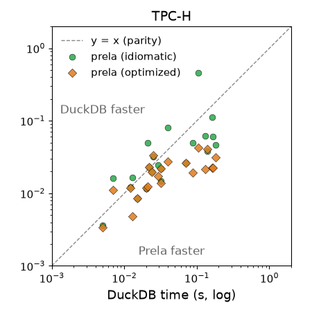
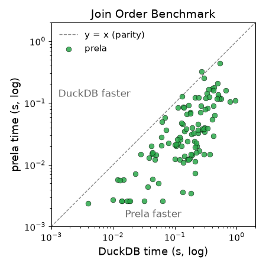

> [!NOTE]
> CIDR reviewers: please visit the [`cidr` branch](https://github.com/remysucre/prela/tree/cidr) of the repository
> for example queries and steps to reproduce the experiments. 

[**Prela**](https://github.com/remysucre/prela) is an embedded query language focusing on compositionality and control. 
Its queries are concise, clear, and fast.
It is implemented as a library of *query combinators* (think [parser combinators](https://en.wikipedia.org/wiki/Parser_combinator)),
 allowing the user to freely intermix queries with code in the host programming language. 
The implementation follows [continuation-passing style](https://remy.wang/blog/cps.html),
 resulting in a core engine under 1k lines of code that compiles to efficient columnar execution.
Unlike almost all SQL databases, Prela does not come with its query optimizer,
 and executes queries exactly as they are written.
This gives the user complete control over all aspects of query planning,
 including join ordering, operator pushdown, materialization, and selection of physical data structures.
Nevertheless, the most idiomatic way to write a query already performs well in our experiments. 

> "The calculus of relations has an intrinsic charm and beauty which makes it a source of intellectual
> delight to all who become acquainted with it." 
>  
>    —Alfred Tarski

### Tutorial

If you're ready to learn Prela, check out [this interactive tutorial](https://prela-lang.org/tutorial/) that
 implements a simplified version of the langauge in 11 lines of code.

### Examples

Prela code is highly compact. The following query is equivalent to [20+ lines of SQL](https://github.com/gregrahn/join-order-benchmark/blob/master/16b.sql):

```rust
movie.with(company.s(country).eq("[us]")
      .and(keyword.eq("character-name-in-title")))
   .select(title.and(cast.s(person).s(alias).s(text)))
```

Thanks to a solid [algebraic foundation](https://arxiv.org/abs/2607.26356), 
 queries can be written in a compositional way.
The following query corresponds to [TPC-H q10](https://github.com/dragansah/tpch-dbgen/blob/master/tpch-queries/10.sql):

```rust
let returns = lineitem.with(returnflag.eq("R")
                       .and(order.s(date).during(19931001, 19940101)))

let customer_info = Customer::name
               .and(Customer::acctbal)
               .and(Customer::nation.s(name))
               .and(Customer::address)
               .and(Customer::phone)
               .and(Customer::comment)

returns.group_by(order.s(customer))
         .select(extendedprice.and(discount))
           .fold(0.0_f64, |a, (e, dc)| a + e * (1.0 - dc))
            .and(customer_info) 
```

### Performance

Unlike almost all analytical databases, Prela has no query optimizer.
This is because every Prela query is also a query plan,
 giving the programmer has complete control over all aspects of 
 performance tuning including join ordering, operator pushdown,
 and the selection of physical data structures.

The plots below compare Prela against DuckDB 1.5.3 (1 thread) as baseline,
 over TPC-H and the Join Order Benchmark.
On JOB, Prela runs the 113 queries in 5.2s vs DuckDB's 15.3s
 (3.0× faster, winning 99 of 113).
On TPC-H SF=1, idiomatic Prela is within ~1.3× of DuckDB's vectorized engine
 (1.14s vs 0.86s), and an optimized variant beats it by ~2× (0.44s).

<p>
  
  
</p>
